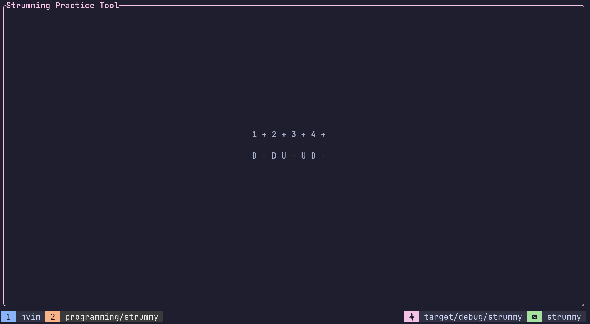

# CLI Guitar strumming practice tool

## What?

A simple cli tool written in Rust using Rattatui. The tool can generate and edit simple strumming patterns. Currently only eight note patterns are supported since this is all I currently need. This will be improved in the future.

## How it looks (right now)

## Features
- Generating new patterns
- Editing patterns
- Saving and loading patterns

## Roadmap
- [ ] Better saving (edit file name and pick what to load)
- [ ] UI displays commands
- [ ] Status bar for better feedback
- [ ] Support for sixteenth note patterns
